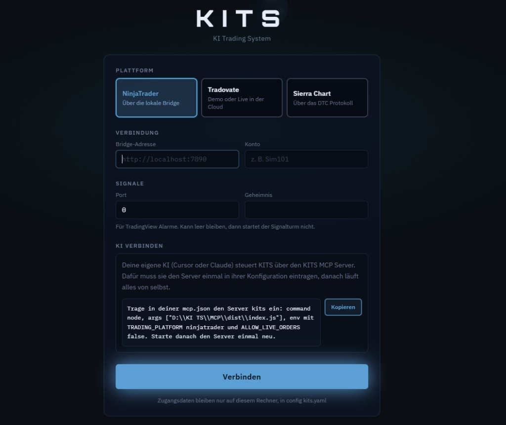
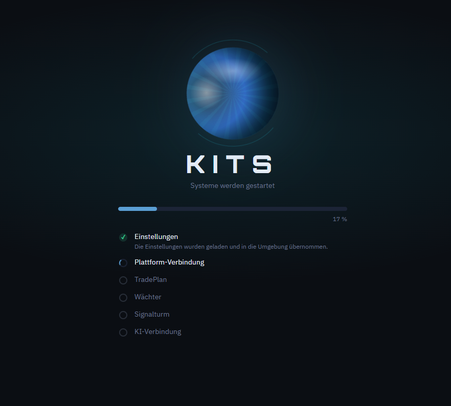
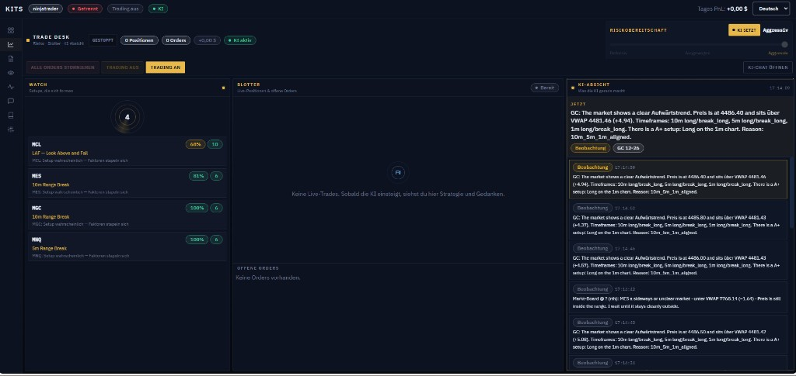
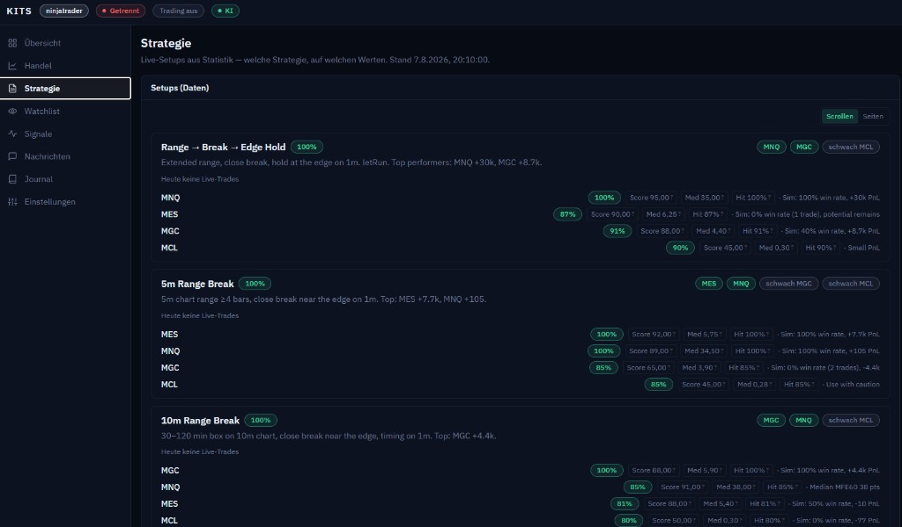
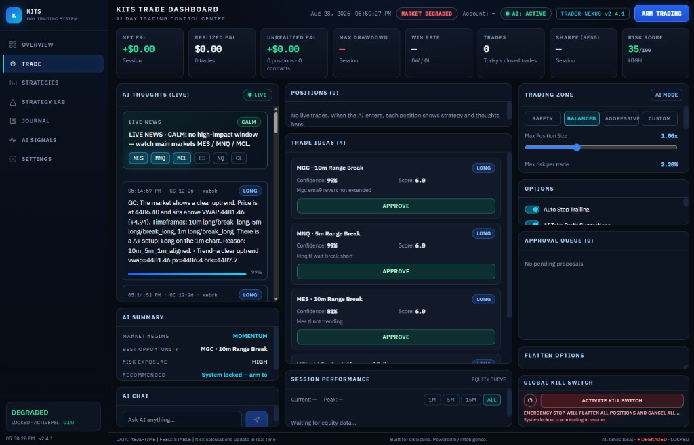

# kits

privates repo. **kein code.** nur bilder und text, was kits macht.

kits ist ein ki trading system. die ki beobachtet die charts, findet setups und kann handeln — **wenn du das willst.** du kannst sie auch nur als hilfe laufen lassen: sie zeigt, was sich formt, du entscheidest.

zwei gänge:

- **hilfe** — ki an, trading aus. sie schaut zu, listet setups, schreibt warum. du nimmst oder lässt.
- **automatisch** — trading an. sie darf vorschläge umsetzen, nach deinen grenzen (risiko, kill switch, bestätigen).

ninja bleibt der chart. kits ist das cockpit daneben.

## bilder

### 1. verbinden

einmal plattform wählen (ninjatrader, tradovate, sierra), konto und bridge. die eigene ki (cursor oder claude) wird über den kits mcp-server angebunden. das trägst du einmal ein — **danach läuft es von selbst**, ohne dass du jedes mal etwas startest.

zugangsdaten bleiben auf dem rechner.

### 2. start

beim verbinden startet kits die teile der reihe nach: einstellungen, plattform, tradeplan, wächter, signalturm, ki. der wächter läuft ohne ki und zieht im notfall die bremse. die ki-verbindung ist der letzte schritt — ab da beobachtet sie.

### 3. trade desk — ki beobachtet, setups formen sich

hier siehst du den alltag.

links **watch**: setups, die sich gerade bauen. beispiel im bild: mcl look-above-and-fail, mes/mgc 10m range break, mnq 5m range break — mit wahrscheinlichkeit. die ki hat die charts schon gelesen, du musst die box nicht selbst suchen.

mitte **blotter**: sobald wirklich gehandelt wird, stehen hier strategie und gedanken zum trade. leer = sie ist noch nicht eingestiegen. das ist gewollt, wenn trading aus ist.

rechts **ki-absicht**: was sie gerade denkt. trend, vwap, mehrere zeitrahmen, a+ oder warten. du liest mit, statt blind zu folgen.

oben **trading an / aus**: der schalter. aus = nur hilfe. an = sie darf, wenn die schleuse und das regelwerk passen.

risiko kannst du selbst setzen oder **ki setzt** lassen.

### 4. strategie — welche setups, auf welchen werten

kein raten. die setups kommen aus statistik: range-break, edge-hold, 5m, 10m. pro instrument score, trefferquote, wo es schwach ist (z.b. mcl). die ki nutzt genau diese liste, wenn sie beobachtet — nicht irgendein gefühl.

du kannst das als spielbuch lesen, ohne dass automatisch geordert wird.

### 5. trade dashboard — vorschläge, du sagst ja

zweites fenster, gleiche idee, klarer auf **approve**.

die ki schreibt live, was sie sieht (z.b. gold über vwap, a+ long, 10m/5m/1m gleichgerichtet). darunter **trade ideas**: range break, trendlinie warten, ema. jeder vorschlag hat **approve**.

so bleibt es hilfe: sie identifiziert, du lässt durch oder nicht.

wer voll automatisch will: modus safety / balanced / aggressive, trailing, take-profit, kill switch. **arm trading** ist extra — ohne den knopf geht nichts live raus.

## kurz

| du willst | so stellst du es |
|---|---|
| nur gucken, setups sehen | ki an, trading aus |
| vorschläge, du klickst ja | ki an, approve |
| sie handelt in deinen grenzen | trading an + arm + regelwerk |

kein code in diesem repo. der laufende stand liegt lokal in kits, nicht hier.
